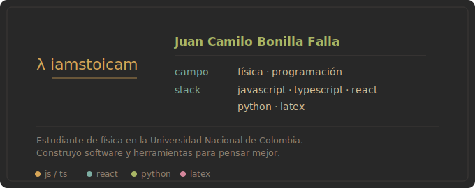

  

 

#### `~/about`

Me interesa el punto donde la estructura matemática de la naturaleza y la
lógica del software se tocan. Trabajo sobre todo en aplicaciones web y móviles
con TypeScript y React, y uso Python y LaTeX para el lado científico.

#### `~/stack`

  
  
  
  
  
  
  

 

"Lo que se puede mostrar, no se puede decir." — Wittgenstein
